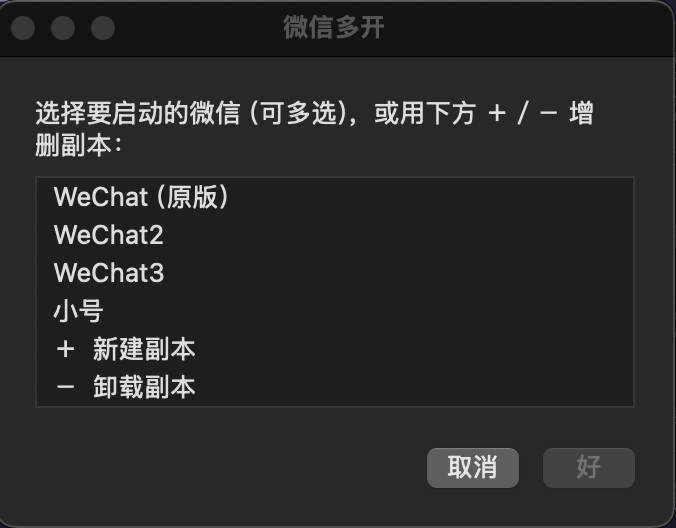

# 微信多开 for macOS

在 macOS 上同时登录多个微信账号，每个副本有独立的聊天数据，互不干扰。不需要管理员密码，不注入代码，不修改原版微信。

核心方法来自 [engrecho/Mac_dual_wechat](https://github.com/engrecho/Mac_dual_wechat)，本项目在其基础上加了图形界面、副本管理和签名校验，详见[致谢](#致谢)。

> **English**: Run multiple WeChat instances on macOS, each with isolated chat data. Works by copying `WeChat.app`, changing its `CFBundleIdentifier`, and re-signing ad-hoc — no code injection, no admin password, the original app stays untouched. Ships as a small AppleScript app with a GUI, plus a CLI script. Built on the method from [engrecho/Mac_dual_wechat](https://github.com/engrecho/Mac_dual_wechat).

<p align="center">
  
</p>

## 原理

macOS 按 `CFBundleIdentifier` 识别应用。同一个 bundle id 的应用，系统只允许一个实例——点 Dock 图标只会激活已在运行的那个窗口。

所以只复制 `WeChat.app` 改个名字是不够的：副本和原版 id 相同，系统仍视为同一个应用，点开还是跳回原版窗口。

真正的多开需要三步：

1. 复制 `WeChat.app` 为 `WeChatN.app`
2. 把副本的 `CFBundleIdentifier` 从 `com.tencent.xinWeChat` 改成 `com.tencent.xinWeChatN`
3. adhoc 重新签名（改了 Info.plist 会让原签名失效）

副本用新 id 启动后，数据目录也变成 `~/Library/Containers/com.tencent.xinWeChatN`，与原版天然隔离，这是账号能分开登录的原因。

## 安装

```bash
git clone https://github.com/nchao/wechat-multi-mac.git
cd wechat-multi-mac
./build.sh
```

编译出「微信多开.app」并装到 `/Applications`。需要 macOS 自带的 `osacompile`，无第三方依赖。

## 使用

双击「微信多开.app」，弹出列表：

```
WeChat（原版）
WeChat2
WeChat3
＋  新建副本
－  卸载副本
```

- 选中一个或多个（按 Cmd 多选）点确定 → 启动。原版直接激活窗口，副本自动完成改 id、签名、启动
- `＋` → 输入名字新建副本，默认填下一个空闲序号
- `－` → 多选卸载，会问聊天数据是保留还是一起删

增删完会回到列表，不用重新打开。启动过程有进度提示（复制 1.4G、签名约 3 秒、等微信响应）。

### 命令行

不想用 GUI 的话，`src/wechat.sh` 提供同样的功能：

```bash
./src/wechat.sh WeChat2 WeChat3               # 新建/启动，支持多个
./src/wechat.sh --list                        # 列出已有副本
./src/wechat.sh --uninstall WeChat3           # 卸载，保留聊天数据
./src/wechat.sh --uninstall --purge WeChat3   # 连聊天数据一起移入废纸篓
```

## 副本命名与数据目录

副本名决定 bundle id，也就决定了数据目录。规则：

| 副本名 | bundle id | 数据目录 |
|---|---|---|
| `WeChat2` | `com.tencent.xinWeChat2` | `~/Library/Containers/com.tencent.xinWeChat2` |
| `小号` | `com.tencent.xinWeChat.小号` | `~/Library/Containers/com.tencent.xinWeChat.小号` |

**改名等于换一份全新数据**，已登录的账号不会跟着走。想保留登录态就沿用原来的副本名。

## 卸载

app 移入废纸篓（不用 `rm`，误删可恢复）。聊天数据默认保留，选「一起删除」才会动 `~/Library/Containers` 下的目录。

原版微信不在卸载候选里。

## 常见问题

**点副本图标却弹出原版微信的窗口**

副本的 bundle id 还是 `com.tencent.xinWeChat`。多数情况是微信更新后重新复制了副本，只改了名字没改 id。用本工具重新处理一次即可。

查当前 id：

```bash
/usr/libexec/PlistBuddy -c "Print :CFBundleIdentifier" /Applications/WeChat2.app/Contents/Info.plist
codesign -dv /Applications/WeChat2.app 2>&1 | grep Identifier
```

两处都应该是 `com.tencent.xinWeChat2`。

**微信升级后副本怎么办**

升级只影响原版。副本还是旧版本，能继续用。想让副本跟上新版，删掉副本再重建（数据目录选择保留，重建后会自动接回）。

**需要管理员密码吗**

不需要。`/Applications` 对 admin 组可写（`drwxrwxr-x root:admin`），微信 app 也归当前用户，复制、改 plist、签名三步都不用提权。如果你的账户不在 admin 组，工具会明确报错。

**能开几个**

没有硬限制，受内存约束。每个副本占 1.4G 磁盘——不过 APFS 写时复制让实际占用远小于此，复制 1.4G 只需约 1 秒。

## 图标

`icon/wxmulti-icon.py` 用 PIL 生成图标，改里面的 RGB 值可换配色：

```bash
pip install pillow
python3 icon/wxmulti-icon.py       # 生成 icon_1024.png
# 转 icns 见脚本注释
```

刻意没沿用微信的绿色底，避免 Dock 里误点。

## 兼容性

- 在 macOS 15.7 / Intel 上开发和验证
- Apple Silicon 未实测，逻辑本身不涉及架构，理论可用
- 微信 4.1.13 验证通过

## 说明

本工具不修改原版微信，不注入代码，不触碰微信的网络通信或协议。所做的只是复制应用、改自己副本的 bundle id、用 adhoc 签名让系统接受这个副本。

多开可能不符合微信的用户协议，请自行判断。副本使用未受信任的 adhoc 签名，某些依赖签名的系统功能（如「访达」共享扩展）可能不可用。

## 致谢

核心方法来自 [engrecho/Mac_dual_wechat](https://github.com/engrecho/Mac_dual_wechat)——复制 `WeChat.app`、改 `CFBundleIdentifier`、adhoc 重签名这三步是那个项目总结并验证的，也是本工具的基础。那边的 README 还维护了一份微信版本兼容记录，值得一看。

本项目在此之上做的是工程化：

- 图形界面，列表式选择，多选批量启动，带进度提示
- 新建与卸载副本，卸载时可选择保留或一并清除聊天数据
- 副本名到 bundle id 的映射规则固定，便于重建后接回原有聊天数据
- 校验签名后的实际 identifier，不一致时明确报错（副本 id 若与原版相同，点图标会跳回原版窗口，这种失败原本很难察觉）
- 去掉了 `sudo`：`/Applications` 对 admin 组可写，微信 app 也归当前用户，三步操作实测都不需要提权

## License

MIT
